A guide on how to create and run a [Left 4 Dead 2](https://store.steampowered.com/app/550/Left_4_Dead_2/) server with **mods** on both [Windows](https://www.microsoft.com/en-us/windows) and Linux!

Left 4 Dead 2 is a popular first-person shooter and zombie horror game set in a post-apocalyptic world overrun by zombies. This game has great modding support and many mods are available through the [Steam Workshop](https://steamcommunity.com/app/4000/workshop/) or through [SourceMod](https://www.sourcemod.net/about.php) [*plugins*](https://www.sourcemod.net/plugins.php?cat=0&mod=6&title=&author=&description=&search=1).

Running a server with mods allows players to connect and enjoy a shared, customized experience using the mods the server has installed.

The two operating systems we'll be targeting specifically in this guide are **Windows 11** and [**Debian 12**](https://www.debian.org/download) (Linux).

I wanted to note a couple of things before continuing in this guide.
* The terms `directory` (known in Linux) and `folder` (known in Windows) are used interchangeably. To keep things simple, we'll be using **directory** in most cases.
* Similarly, we will be using file paths structured `/like/this` throughout the guide. This format is used in Linux, but on Windows, you will need to structure the file path `\like\this` instead.

## Table Of Contents
* [Requirements](#requirements)
    * [Hardware & Network](#hardware--network)
    * [Port Forwarding](#port-forwarding)
* [Downloading The Server Files](#downloading-the-server-files)
* [Running The Left 4 Dead 2 Server](#running-the-left-4-dead-2-server)
    * [Windows](#windows)
    * [Linux](#linux)
        * [Using Screen](#using-screen)
* [Creating Server Config Files](#creating-server-config-files)
    * [Performance ConVars](#performance-convars)
* [How To Mod The Left 4 Dead 2 Server](#how-to-mod-the-left-4-dead-2-server)
    * [Installing SourceMod & MetaMod Plugins](#installing-sourcemod--metamod-plugins)
    * [Using The Steam Workshop](#using-the-steam-workshop)
        * [Create A Collection](#create-a-collection)
        * [Adding Items To The New Collection](#adding-items-to-the-new-collection)
        * [Publish Collection](#publish-collection)
        * [Extracting The Addon's Files](#extracting-the-addons-files)
* [Connect To The Server](#connect-to-the-server)
* [Frequently Asked Questions](#frequenty-asked-questions)
    * [I receive an "Invalid Platform" error when downloading through SteamCMD.](#i-receive-an-invalid-platform-error-when-downloading-through-steamcmd)
    * [How do I add myself or others as admin on the server?](#how-do-i-add-myself-or-others-as-admin-on-the-server)
    * [How do I show and edit file extensions in Windows?](#how-do-i-show-and-edit-file-extensions-in-windows)
    * [Can I make a script to automatically update the server files?](#can-i-make-a-script-to-automatically-update-the-server-files)
    * [How do I enable the developer console?](#how-do-i-enable-the-developer-console)
* [See Also](#see-also)
* [Conclusion](#conclusion)

## Requirements
### Hardware & Network
Left 4 Dead 2 servers are fairly light on RAM usage compared to servers in other games such as [Minecraft](https://www.minecraft.net/) and [Rust](https://store.steampowered.com/app/252490/Rust/). By default, up to **four players** can play concurrently when running game modes such as COOP, Scavenge, and more while Versus can support up to **eight players** concurrently. There are SourceMod plugins that can increase the server's maxplayers **up to 32**!

For information on the hardware and network requirements, I recommend giving the following topic a read.

https://forum.moddingcommunity.com/t/hardware-network-requirements-for-source-engine-servers/197

### Port Forwarding
If you plan on having your server accessible from the Internet, you may need to port forward both UDP and TCP ports `27015` through your router. This guide will not cover port forwarding specifically. However, I did want to provide other helpful guides on how to port forward the ports I've just mentioned.

* [NordVPN - How to open ports on your router](https://nordvpn.com/blog/open-ports-on-router/)
* [No-IP - How to Port Forward – General Guide to Multiple Router Brands](https://www.noip.com/support/knowledgebase/general-port-forwarding-guide)
* [PortForward - How To Forward a Port](https://portforward.com/)

If your LAN network is operating as a [NAT](https://www.comptia.org/content/guides/what-is-network-address-translation) network, you may need to create a NAT rule as well.

## Downloading The Server Files
The next step is to download the server files using [SteamCMD](https://developer.valvesoftware.com/wiki/SteamCMD). Give the following topic a read and keep in mind the Left 4 Dead 2 server's application ID is `222860`.

https://forum.moddingcommunity.com/t/how-to-download-run-steamcmd/190

## Running The Left 4 Dead 2 Server
To save time, we're going to create start-up scripts for the Left 4 Dead 2 server. We will be creating scripts for both Linux and Windows that starts up the server running the `c8m1_apartment` map which is the first level of the [No Mercy campaign](https://left4dead.fandom.com/wiki/No_Mercy). The server will be bound to all IP addresses and interfaces (`0.0.0.0`) on UDP port 27015.

### Windows
When looking at the new server files through the File Explorer, you should see a file named `srcds.exe`.

We will be creating a [Batch](https://en.wikipedia.org/wiki/Batch_file) file/script named `start-server.bat` to run the server. Before creating this file, you will need to ensure you can set the file's extension by ensuring you're able to view extensions in file names. If you can't view file extensions, read [here](#how-do-i-show-and-edit-file-extensions-in-windows).

After creating the Batch file, add the following contents.

```batch
@echo off
.\srcds.exe -game left4dead2 -console -ip 0.0.0.0 -port 27015 +maxplayers 4 +map c8m1_apartment
```

You should now be able to double-click the newly created Batch file to start the server!

### Linux
After navigating to the server file's directory by executing `cd ~/l4d2` or similar, you should see `srcds_run` and `srcds_linux` files inside of the directory. We will be creating a simple Bash script to start the server.

There are many different types of text editors you use to create the script such as [Nano](https://www.nano-editor.org/) and [Vim](https://www.vim.org/), in this tutorial we will be using Nano. We will name the script `start-server.sh`.

Firstly, use the following command to start editing the new file.

```bash
nano start-server.sh
```

Next, paste the following contents into the file.

```bash
#!/bin/bash
./srcds_run -game left4dead2 -console -ip 0.0.0.0 -port 27015 +maxplayers 4 +map c8m1_apartment
```

After you're finished, hit `CTRL` + `X` and enter to save the file. If you would like to see the contents of the file, you may execute `cat start-server.sh`.

Once you've saved the file, you will also want to give the user permission to execute the file which may be done with the command below.

```bash
chmod u+x start-server.sh
```

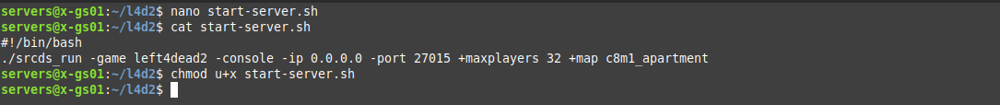

Finally, you can start the server using the following command.

```bash
./start-server.sh
```

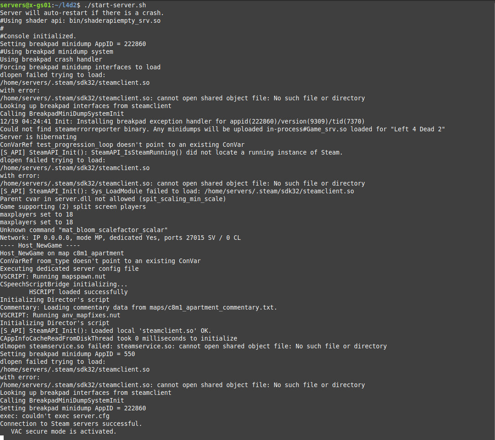

**NOTE** - You should see a `VAC secure mode is activated` message unless if you've specifically disabled VAC. With that said, if you want the server accessible from the Internet, you should also see a `Public IP is <your WAN IP>` message which is stripped out of the screenshot above.

To stop the server, you can execute the `quit` command through the server console or hit `CTRL` + `C` which sends a signal to terminate the server's process.

#### Using Screen
Once installed, you may also use the `screen` command to allow the server to run without needing to keep the Linux terminal open (in the background). I'd recommend reading up on the `screen` command [here](https://www.geeksforgeeks.org/screen-command-in-linux-with-examples/).

First, let's install the screen package. You may need to log out of the current `servers` user via the `exit` command since the command must be ran as root or via `sudo`.

##### Debian/Ubuntu
```bash
sudo apt install -y screen
```

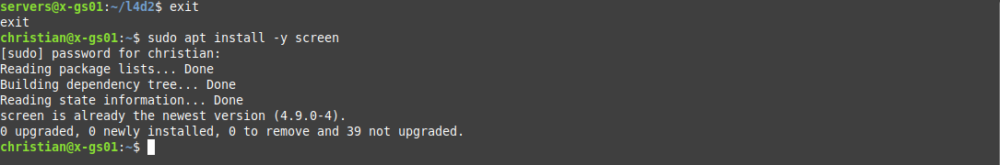

Next, copy the server startup command and add `screen -S <name>` in-front. Here is an example.

```bash
screen -S l4d2 ./srcds_run -game left4dead2 -console -ip 0.0.0.0 -port 27015 +maxplayers 4 +map c8m1_apartment
```

This will launch the server inside a screen. You can detatch from the screen using `CTRL` + `A` + `D` by default.

To attach the screen, you may run either `screen -r` (if there's only one screen open, it'll automatically attach to the single screen) or `screen -r <name>`. In the above command, we created a screen named `l4d2`. Therefore, we can use the following command to attach to the screen by name.

```bash
screen -r l4d2
```

You may also change the server's startup script and prepend `screen -S <name>` similar to the above to have the script automatically launch the server into a screen.

## Creating Server Config Files
The next step is to configure the server by creating two files; `autoexec.cfg` and `server.cfg`. The `autoexec.cfg` will be used for setting the server's game type (e.g. COOP, Versus, etc.) and only executes once on server startup while the `server.cfg` file will contain general information such as the host name (the display name inside of the server browser) and is executed on the start of every map. Both files will be located in the `left4dead2/cfg` directory.

The configuration format Left 4 Dead 2 uses inside of these files is `<ConVar> "<Value>"`.

Paste the following contents into the `autoexec.cfg` file.

```bash
sv_gametypes "coop,survival"
```

The `sv_gametypes` ConVar controls what game types the server will run. You may select from the values `coop`, `realism`, `survival`, `versus`, `scavenge`, `dash`, `holdout`, and `shootzone`. You can also specify multiple by separating the values with commas (`,`). For example: `coop,versus,survival`.

**NOTE** - You can also set the `sv_gametypes` ConVar value through the server's startup command by adding `+sv_gametypes <...>`. However, I personally prefer using the `autoexec.cfg` file since there are cases where you may want to restrict access to the command line from certain users that you would still like to have access to alter the server's game types and so on.

Next, Paste the following contents into the `server.cfg` file and modify the ConVar's values to your needs.

```bash
hostname "My Server Name"
sv_password ""
rcon_password "CHANGEME"
```

* The `hostname` is the name of the server seen through the server browser or on external websites (anything that queries the server through [A2S](https://developer.valvesoftware.com/wiki/Server_queries) queries).
* The `sv_password` is the password players must enter before joining the server. When left blank, no password prompt pops up when joining the server.
* The `rcon_password` is the password required for [RCON](https://developer.valvesoftware.com/wiki/Source_RCON_Protocol) access. This password should only be known by trusted individuals/staff since users with this password will be able to execute server commands assuming they're able to access the TCP port RCON is running on remotely.

There are also many other ConVars you may like inside of Left 4 Dead 2 that you can set through the `server.cfg` file! [Here's](https://developer.valvesoftware.com/wiki/List_of_Left_4_Dead_2_console_commands_and_variables) a good list of ConVars in Left 4 Dead 2.

### Performance ConVars
There are a few ConVars you may set to help improve the server's performance depending on your network speeds, available bandwidth, and server hardware.

Give the following section of the guide linked earlier a read!

https://forum.moddingcommunity.com/t/hardware-network-requirements-for-source-engine-servers/197#p-226-the-servers-performance-rate-convar-values-5

## How To Mod The Left 4 Dead 2 Server
There are two methods used when modding a Left 4 Dead 2 server.

The most common method is to install [SourceMod](https://www.sourcemod.net/about.php) and [MetaMod](https://www.sourcemm.net/about) onto the server and install SourceMod plugins.

The less common method is to subscribe to items through the Left 4 Dead 2 [workshop](https://steamcommunity.com/workshop/) and use a tool like [this](https://github.com/Geam/steam_workshop_downloader) to extract the addon's files and then add the files to the server.

Using SourceMod and MetaMod to mod your Left 4 Dead 2 server is recommended since there are many more plugins and functionality included.

### Installing SourceMod & MetaMod Plugins
Firstly, you'll need to download and install SourceMod onto your Left 4 Dead 2 server. I recommend reading the following guide I made a while ago on how to do this!

https://forum.moddingcommunity.com/t/how-to-install-update-metamod-sourcemod-on-source-engine-servers/60

Next, you'll want to find plugins from [here](https://www.sourcemod.net/plugins.php?cat=0&mod=6&title=&author=&description=&search=1). Generally, the plugin's description includes details on how to install the plugin. However, the following is a good rule of thumb.

* Files that end with the `.sp` file extension contain the plugin's source code written with SourcePawn.
* Files that end with the `.smx` file extension are the compiled source code and should be placed inside the `addons/sourcemod/plugins` directory.
* Files that include `games.txt` (or something like `l4d2.txt`) in the file name are normally gamedata files and should be placed inside of the `addons/sourcemod/gamedata` directory.
* Files that include `phrases.txt` in the file name are translation files and should be placed inside of the `addons/sourcemod/translations` directory.
* Files that end with the `.so` or `.dll` file extensions are usually SourceMod extensions that should be placed inside of the `addons/sourcemod/extensions` directory.

In some cases, you may need to compile the plugins's source code. Read the following topic for instructions on how to do this!

https://forum.moddingcommunity.com/t/how-to-compile-sourcemod-plugins/194

### Using The Steam Workshop
In some cases, a mod you want may only be available through the Steam Workshop. This is common with custom campaigns. Unfortunately, Left 4 Dead 2 servers do not natively support the Steam Workshop unlike other games like [Garry's Mod](https://store.steampowered.com/app/4000/Garrys_Mod/).

Therefore, we will need to extract files from the workshop item(s) and add them to the server files.

#### Create A Collection
The first thing we'll want to do is create a collection. You can do this within the Steam application itself or through Steam's website. We will be using the Steam application in this guide (they both generally have the same interface).

Firstly, navigate to **Community** -> **Workshop**.

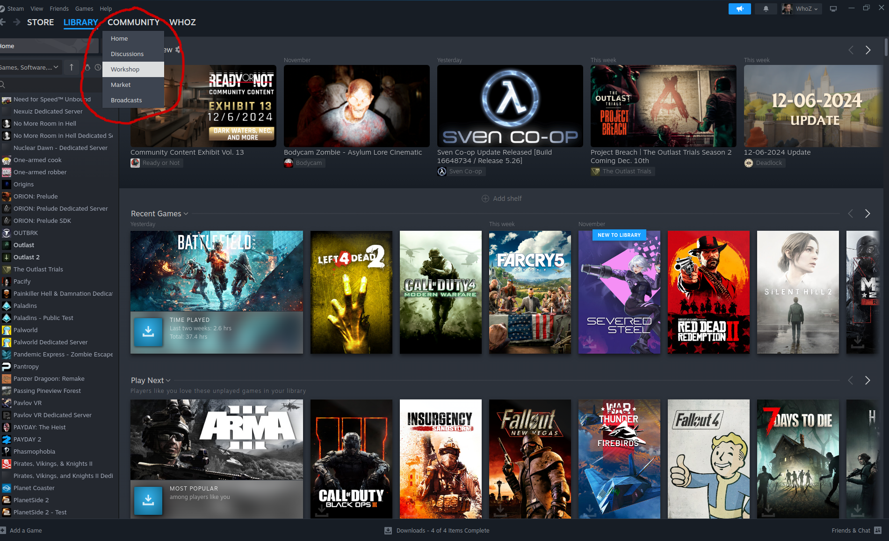

Next, you'll want to type in **Left 4 Dead 2** where it says "Search for a Workshop". You can click the item from the drop-down menu.


Now, click the **Browse** drop-down menu near the left-middle of the screen and click **Collections**.

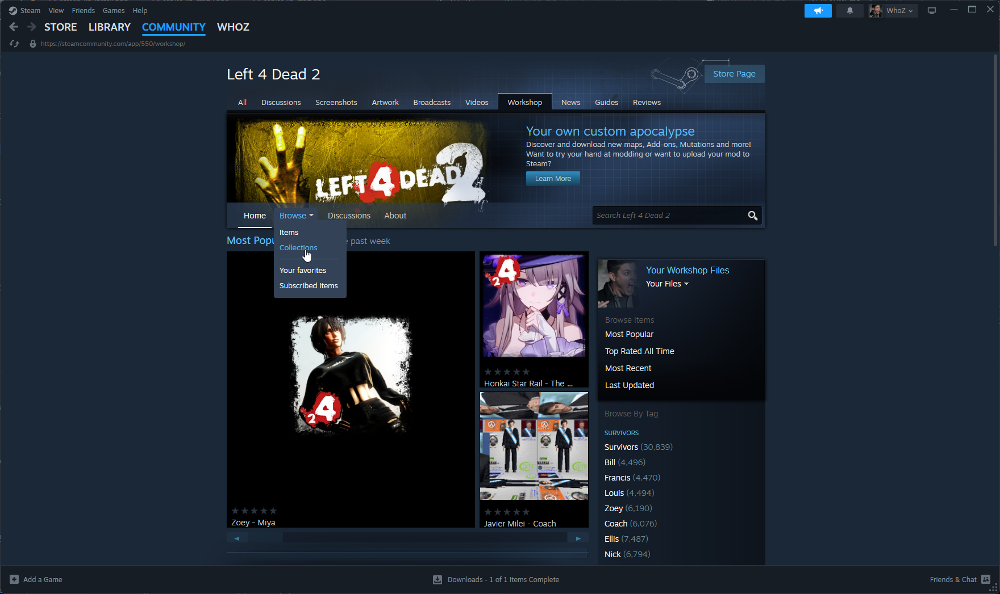

Afterwards, click the **Create Collection**.

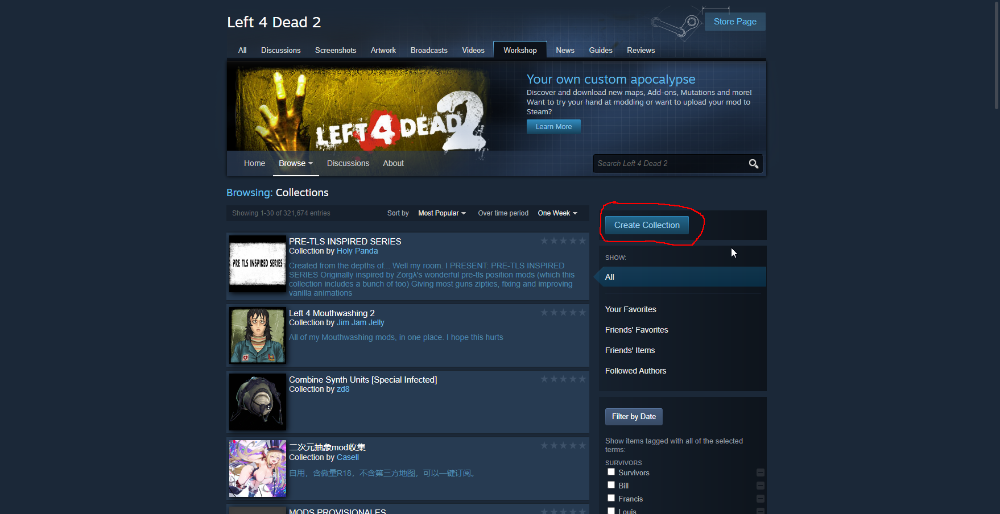

You'll want to then fill out all fields on the page. In this guide, the title will simply be "Test Collection".

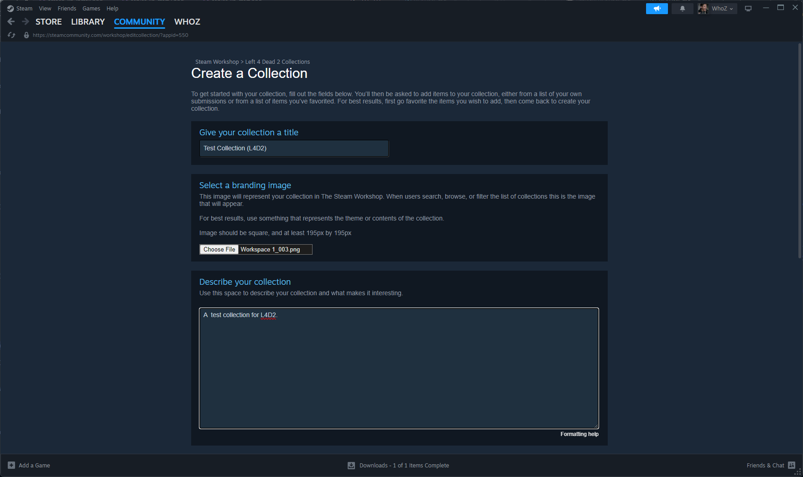

Finally, click the **Save and continue** button on the bottom-right to create the collection.

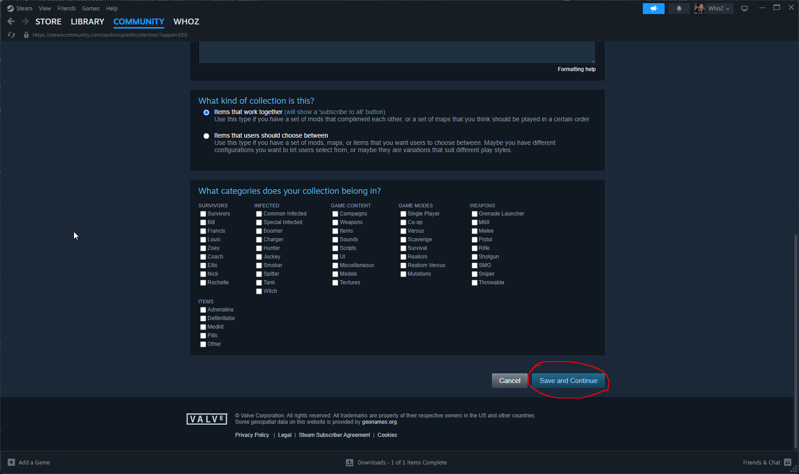

From here, you'll want to keep note of the numeric collection ID which is available in the Steam URL bar after `?id=`. We will need this later.

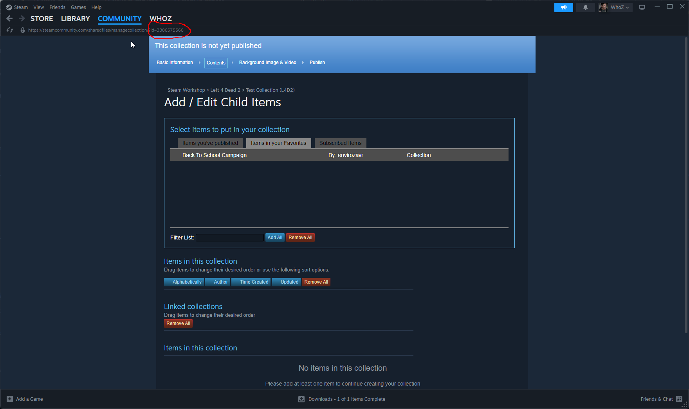

For example, the collection ID of following URL is `3386575566`.

```
https://steamcommunity.com/sharedfiles/managecollection/?id=3386575566
```

**NOTE** - If the collection is published and visible to others, users will be able to subscribe to all mods/addons from the collection with one click.

#### Adding Items To The New Collection
Either find a workshop item to add to the collection to by browsing the Left 4 Dead 2 workshop [here](https://steamcommunity.com/app/550/workshop/) or use a direct link to the item.

From here, click the **Add to Collection** button.

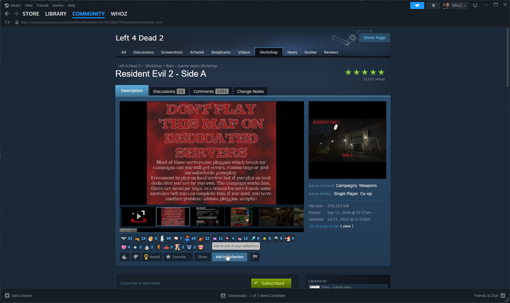

This will bring up a checkbox list of all collections you own. Ensure to check the collection you want the item added to and click **Ok**.

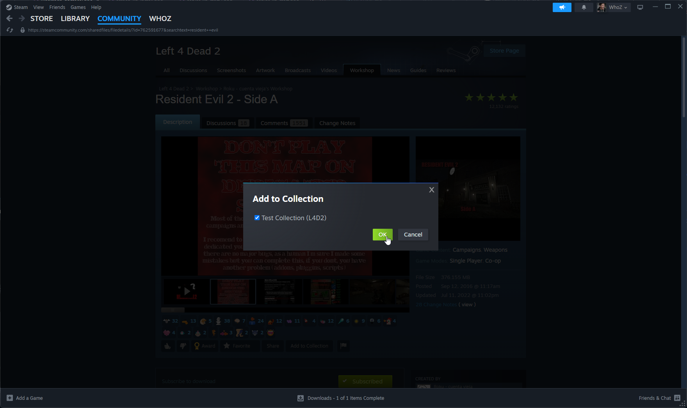

#### Publish Collection
Now, go back to the collection you've made and publish it by clicking the **Publish** button.

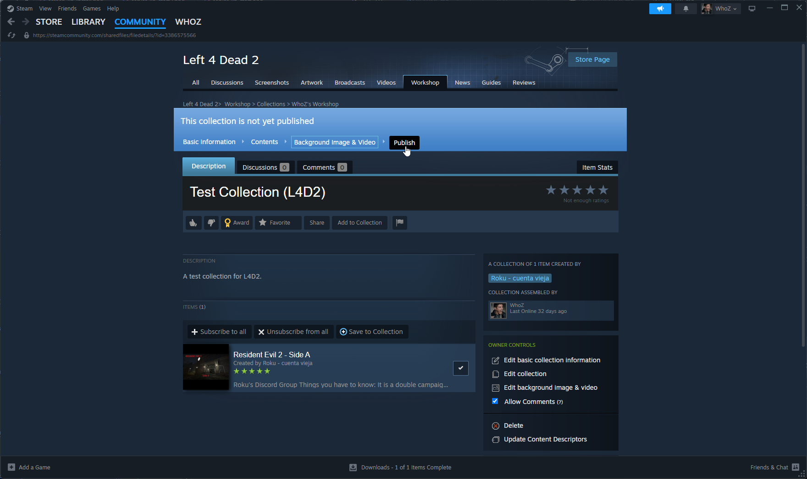

#### Extracting The Addon's Files
It is recommended you use [this](https://github.com/Geam/steam_workshop_downloader) tool to extract the files of each addon inside of a collection.

This tool was made with Python and I recommend giving [this](https://www.pythonguis.com/installation/install-python-windows/) a read for installing Python on Windows and [this](https://docs.python-guide.org/starting/install3/linux/) a read for installing Python on Linux.

You can either download the tool directly from GitHub's website [here](https://github.com/Geam/steam_workshop_downloader/archive/refs/heads/master.zip) or use `git clone https://github.com/Geam/steam_workshop_downloader` if you have Git installed on your system.

After installing Python and downloading the tool, execute the following command.

```bash
./workshop.py <Collection ID>
```

Where `<Collection ID>` is the ID we've retrieved above. For example:

```bash
./workshop.py 3386575566
```

On Windows, you may need to prepend `python` to the command above like this.

```bash
python .\workshop.py <Collection ID>
```

After this is done, you should see `*.vpk` files.

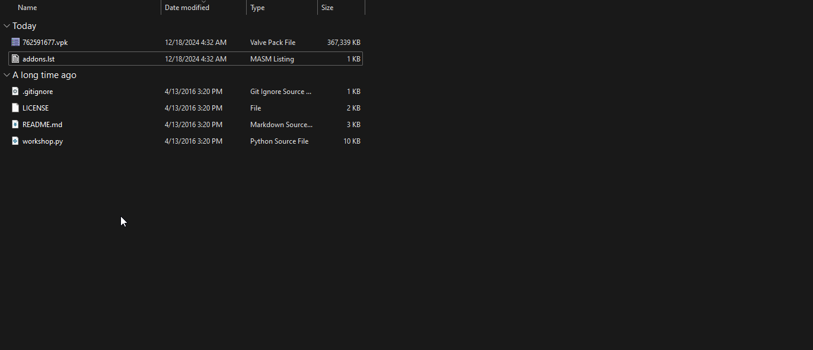

Now, upload/copy these files to your server's `addons/` directory and restart the server!

When the server is restarted, the VPK files you've added to the `addons/` directory should automatically mount. If custom campaigns were added, in order to load maps, you need to know the map file names that end with the `bsp` file extension. If you can't find this information, you can try using a tool such as [GCFScape](https://developer.valvesoftware.com/wiki/GCFScape) to extract files from the VPK files. From here, you can locate the names of the map files.

Additionally, you may use the command `show_addon_metadata` to display information about addons that are mounted. For example, after adding the [Resident Evil: Side A](https://steamcommunity.com/sharedfiles/filedetails/?id=762591677) custom campaign to my Linux L4D2 server, this is what I see when executing the command on my server.

```
show_addon_metadata
MISSION: re2birkina     (/home/servers/l4d2/left4dead2/addons/762591677.vpk)
```

### Connect To The Server
Now let's connect to the server! You can either connect to the server through the server browser by executing `openserverbrowser` in the developer console or directly connect to your server.

To open your developer console, hit the \` or `~` key on your keyboard. If your developer console is not working, it likely is disabled and you'll need to read [here](#how-do-i-enable-the-developer-console) on how to enable it!

If you want to directly connect to the server, you'll want to obtain the IPv4 address or hostname you need to connect to. If your server is hosted through a dedicated hosting provider, you should be able to find the IPv4 address/hostname required in multiple places including the following.

* Through your hosting provider's web panel.
* Using the public IP that is announced when starting the server.

**NOTE** - An IPv4 is in `xxx.xxx.xxx.xxx` format while a hostname is either a name or a domain (e.g. `myserver` or `myserver.mydomain.com`).

If you're on the server itself or the server is locally hosted, you can also obtain the IP of the server by listing your network interfaces + IPs using the `ip a` or `ifconfig` commands on Linux or `ipconfig /all` command on Windows (use Command Prompt or PowerShell).

After finding the IP, launch Left 4 Dead 2 and hit the `\` (or `~`) key on your keyboard to open the developer console.

When the developer console is shown, you will want to type `connect <ip/hostname>` or `connect <ip/hostname>:<port>`. Since we've bound the server to the default Left 4 Dead 2 port `27015`, we do not need to input a port in this case.

I'm going to use my server's internal hostname which is simply `x-gs01` under my home network.

```bash
connect x-gs01
```

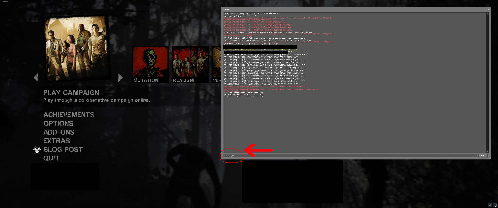

You should now be connected to your Left 4 Dead 2 server! You can type `status` in your Developer Console to confirm.

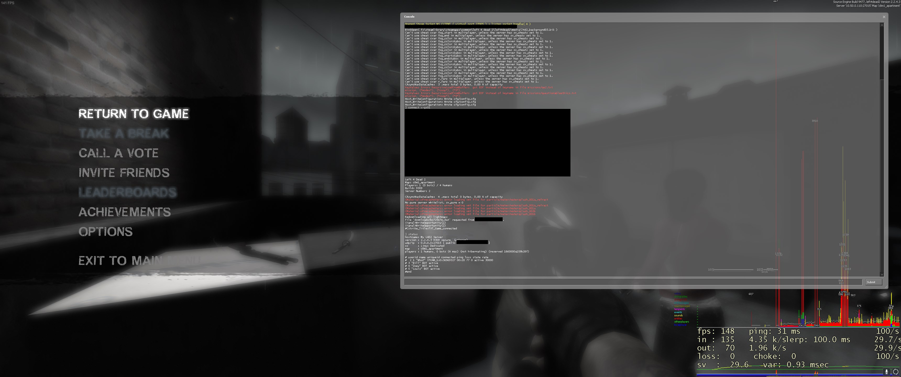

## Frequenty Asked Questions
### I receive an "Invalid Platform" error when downloading through SteamCMD.
If you're experiencing this error on Linux when downloading the Left 4 Dead 2 server files, you are most likely running into [this](https://github.com/ValveSoftware/steam-for-linux/issues/11522) issue that arose in late 2024 due to a change through Steam.

There are two solutions to this issue from what I've foun.

1. Use your Steam crendentials when logging in through SteamCMD. When executing the `login` command in this guide, enter your Steam's username followed by a space and then your password. E.g. `login whoz MYPASSWORD`.

2. Run SteamCMD twice via a single command using both Windows and finally Linux which resolves the issue.

```bash
# Use Windows as platform path really quick.
./steamcmd.sh +force_install_dir ../l4d2 +@sSteamCmdForcePlatformType windows +quit

# Finally use Linux which should then start the download successfully.
./steamcmd.sh +force_install_dir ../l4d2 +@sSteamCmdForcePlatformType linux +app_update 222860 +quit
```
### How do I add myself or others as admin on the server?
If you have SourceMod and MetaMod installed on your Left 4 Dead 2 server, you can add yourself or others as admin.

For steps on how to do this, keep the following topic a read!

https://forum.moddingcommunity.com/t/how-to-manage-user-permissions-in-sourcemod/193

### How do I show and edit file extensions in Windows?
To view hidden file extensions in Windows 11, through File Explorer, click **View** -> **Show** and ensure the **File name extensions** box is checked.

This process is very similar in other versions of Windows as well.

To show file name extensions on other versions of Windows, I'd recommend checking out [this](https://www.howtogeek.com/205086/beginner-how-to-make-windows-show-file-extensions) guide!

### Can I make a script to automatically update the server files?
Yes, this is possible!

Give the following section of the guide linked earlier a read! Keep in mind that the Left 4 Dead 2 server application ID is `222860`!

https://forum.moddingcommunity.com/t/how-to-download-run-steamcmd/190#p-219-automation-with-script-files-7

### How do I enable the developer console?
By default, the developer console is not enabled in Left 4 Dead 2.

To enable it, launch Left 4 Dead 2 and click the **Options** menu item. From here, click the **Keyboard & Mouse** item from the drop-down menu.

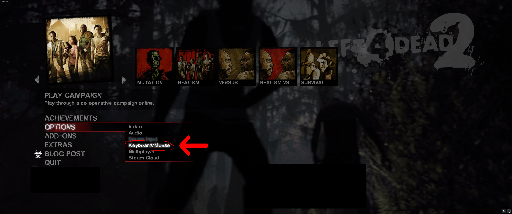

Next, toggle the **Allow Developer Console** option from *Disabled* to *Enabled*.

Finally, click the **Done** button!

You should now be able to open the console by hitting or holding the \` or `~` key on your keyboard.

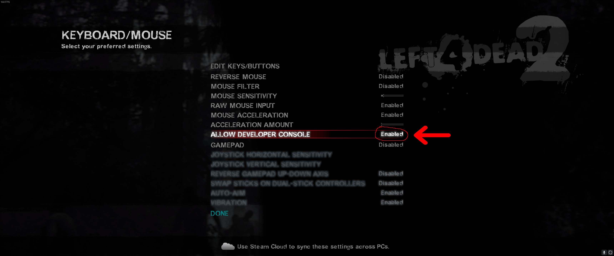

## See Also
I just wanted to provide some helpful resources and tools for server owners who want to improve their management experience in Left 4 Dead 2.

* [Pterodactyl](https://pterodactyl.io/) - A very popular **open source** game server panel for Linux which provides tools to easily create and manage servers in games such as Left 4 Dead 2, Counter-Strike, Rust, Minecraft, FiveM, and more.

## Conclusion
That sums up this guide, but I hope to create many more guides in the future! By this point, you should have a functioning Left 4 Dead 2 server with one or more mods/addons installed.

If you see anything that can be improved on or added, please feel free to reply to this topic!